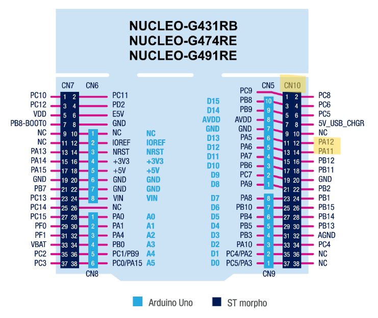

# Hardware Wiring Guide

This document describes the hardware connections used to establish Classic CAN communication between two STM32G474RE NUCLEO boards using CJMCU TJA1051 CAN transceiver modules.

---

# Hardware Used

| Component | Quantity |
|-----------|---------:|
| STM32 NUCLEO-G474RE | 2 |
| CJMCU TJA1051 CAN Transceiver | 2 |
| 120 Ω Termination Resistor | 2 |
| Breadboard | 2 |
| Jumper Wires | As required |

---

# System Overview

```
             Node A                              Node B
      ┌────────────────┐                  ┌────────────────┐
      │ STM32G474RE    │                  │ STM32G474RE    │
      │                │                  │                │
      │   FDCAN1       │                  │    FDCAN1      │
      └──────┬─────────┘                  └──────┬─────────┘
             │                                   │
      ┌──────▼─────────┐                  ┌──────▼─────────┐
      │ CJMCU TJA1051  │                  │ CJMCU TJA1051  │
      └──────┬─────────┘                  └──────┬─────────┘
             │                                   │
      CANH ──┼───────────────────────────────────┼── CANH
      CANL ──┼───────────────────────────────────┼── CANL
             │                                   │
            GND────────────────────────────────GND
```

---

# STM32 to TJA1051 Connections

## Node A

| STM32 Pin | TJA1051 Pin | Description |
|------------|-------------|-------------|
| PA12 | TXD | FDCAN1 Transmit |
| PA11 | RXD | FDCAN1 Receive |
| 3.3V | VCC | Power Supply |
| GND | GND | Common Ground |

---

## Node B

| STM32 Pin | TJA1051 Pin | Description |
|------------|-------------|-------------|
| PA12 | TXD | FDCAN1 Transmit |
| PA11 | RXD | FDCAN1 Receive |
| 3.3V | VCC | Power Supply |
| GND | GND | Common Ground |

---

# CAN Bus Connections

| Node A | Node B |
|---------|--------|
| CANH | CANH |
| CANL | CANL |
| GND | GND |

---


# NUCLEO Pin Mapping

The STM32 FDCAN peripheral uses:

| Function | STM32 Pin |
|----------|-----------|
| FDCAN1_TX | PA12 |
| FDCAN1_RX | PA11 |

---

## Figure 1 – STM32G474RE Pinout


This figure highlights the FDCAN TX and RX pins used in this project.

---

## Figure 2 – Final Hardware Setup


This image shows the final working hardware setup after correcting the pin mapping.

---

# Common Wiring Mistakes

## Incorrect MCU Pin Mapping

During development, the STM32 pins were initially connected to the wrong NUCLEO header pins.

Symptoms observed:

- No CAN communication
- TX FIFO became full
- Node A entered Bus-Off
- Node B never received frames

Although the software configuration was correct, the CAN transceiver never received the proper TX/RX signals.

Correcting the wiring immediately restored communication.

---

# Wiring Checklist

Before powering the system, verify the following:

- [ ] PA12 connected to TXD
- [ ] PA11 connected to RXD
- [ ] 3.3V connected to VCC
- [ ] Common GND connected
- [ ] CANH connected to CANH
- [ ] CANL connected to CANL
- [ ] Two 120 Ω termination resistors installed
- [ ] Both STM32 boards powered